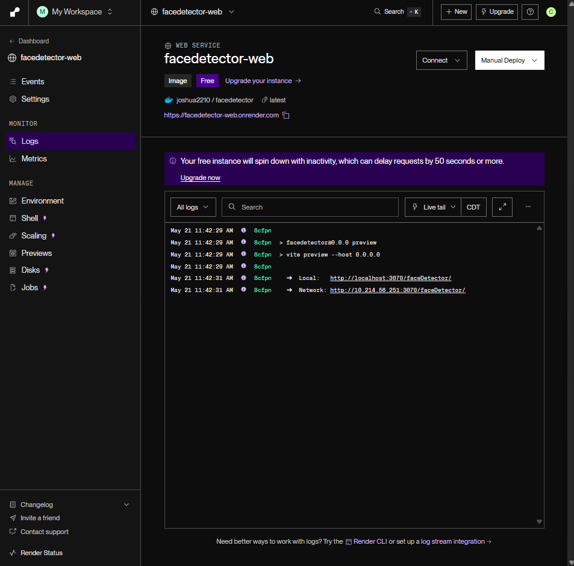
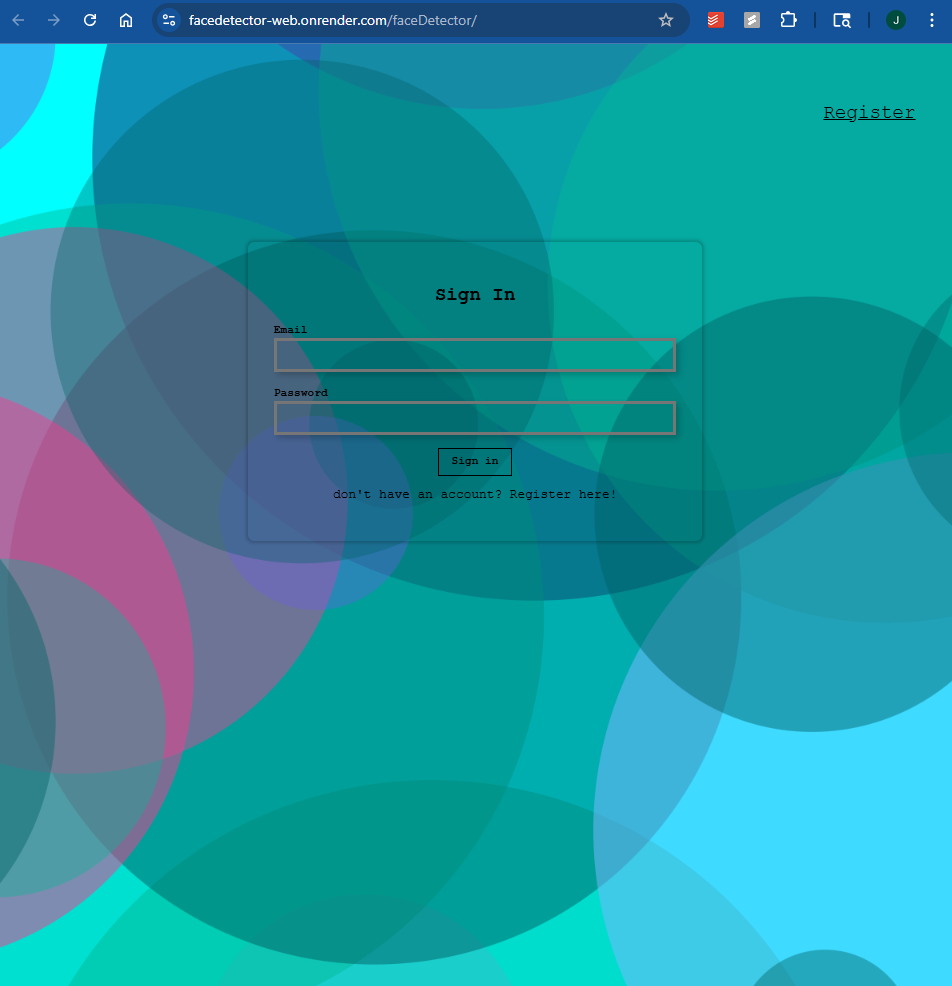

# to use the website
note: this website may take a few seconds to load, because render.com may not keep the server running all the time

- go to https://facedetector-web.onrender.com/

# information on hosting website
- https://dashboard.render.com/web/srv-d0hsds56ubrc73cuh1r0/deploys/dep-d0hsijl6ubrc73culdj0

# learnings
- quick developments
    - using bootstrap for quick UI development (https://getbootstrap.com/docs/5.3/getting-started/download/#:~:text=%3Clink%20href,%3E%3C/script%3E)
    - using animation.css for quick animation development (https://animate.style/)
    - babel is used to convert modern JavaScript code into a version that can run in older browsers
- javascript
    - using asynchronous http request (get, post, put, delete)
- using vite for development
    - vite is a build tool that aims to provide a faster and leaner development experience for modern web projects
    - vite is a frontend build tool that provides a development server and a build command
    - vite uses esbuild under the hood to provide fast builds and hot module replacement (HMR)
    - converts jsx to js
- react
    - creating reusable components
    - react hooks
    - react useState
    - react props
    - component lifecycle : componentDidMount, componentDidUpdate, componentWillUnmount
- express end points to connect between front end and back end
- docker
    - docker image
    - docker container
    - docker build : to build the docker image
    - writing Dockerfile so that the docker image can be built with teh docker built command
    - docker run : to run the docker image (automatically creates a container)
    - using .Dockerignore file to ignore files that are not needed in the docker image. (like .gitignore)
    - docker port : 2 ports are needed to run the docker image
        - one port is used to run the docker image
        - the other port is used to access the website (which is unnecessary if you are using render.com)
    - docker ps : to see the running containers
- render.com
    - https://dashboard.render.com/web/srv-d0hsds56ubrc73cuh1r0/logs
    - hosting the front end part of the website on render.com
    - changing all the featch request url to the backend url hsoted throug render.com of another repo
- creating environmental variables (i ddin't use a .env file, but I should have)
- writing test cases
    - files added or changed:
        - *.test.jsx
        - .babelrc
        - __mocks__/fileMock.js
        - just.config.js
    - using jest to run the test cases
    - how to test:
        - test the behaviour of the components and functions and not how they are implemented

    
# to run the front end website through docker image
note: this is unnecessary if you are running the website through render.com
- if you haven't built the docker image yet, run the following command:
- docker build -t [image name] .
- [image name] can be any name you want to give to the image, for example, facedetector
- docker run -t -p 5000:8080 [image ID - can be found through docker application]
- the console will then print out this url: http://localhost:8080/faceDetector/
- 8080 is the port docker used to run the image, but to access the website, we need to use another port, ex: 5000.
- so go to a browser and type in http://localhost:5000/faceDetector/

# future development
- add more ways to upload images rather than pasting the image url from google
- improve the UI
    - better design
    - better CSS styling
    - more user friendly: maybe more interactve buttons or animations
    - better color scheme
    - better layout which is responsive to different screen sizes
- improve the security
    - use express-session to store the session in the server
    - use express-session to store the session in the client
- try hosting it through AWS and figure out how to use AWS S3 to store the images and how to scale the website usage too
- write some unit tests to test the website